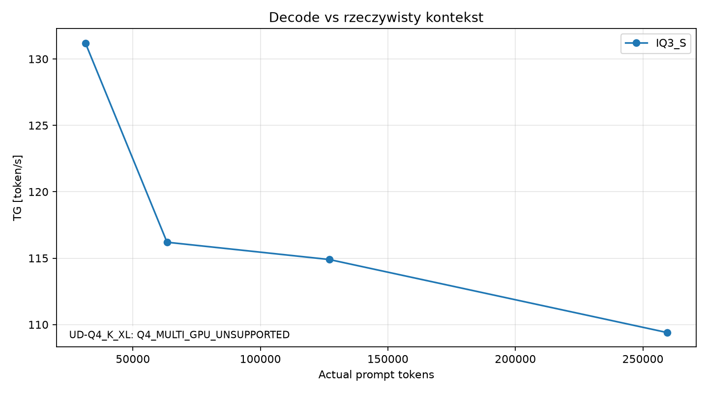
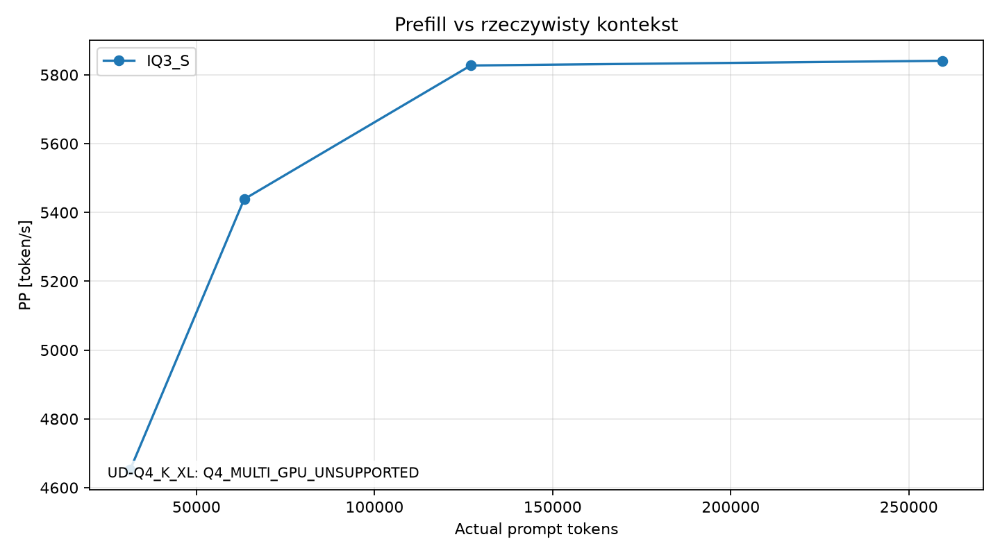
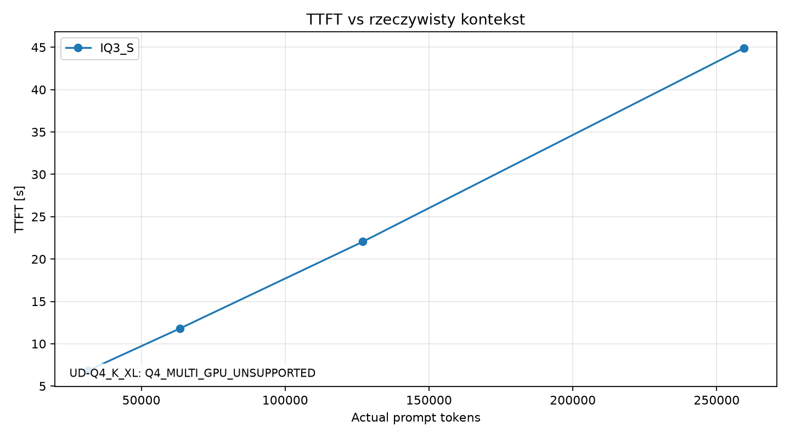
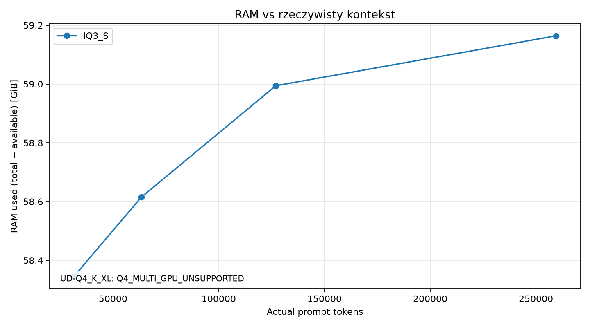
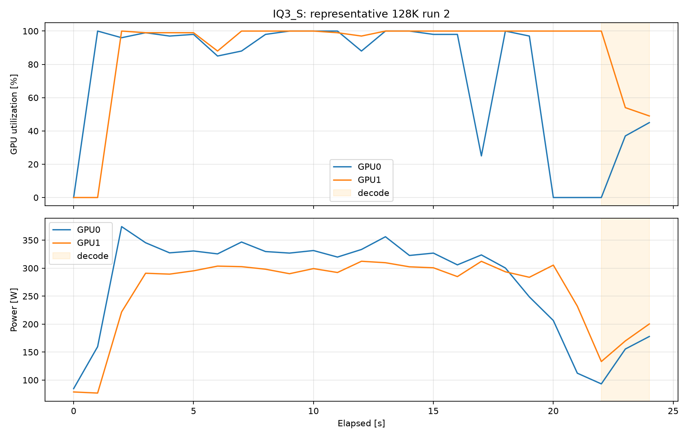

# Strata Qwen3.8-Flash-Next: 2× RTX 4090

HEAD: `9259cad4cfa3543cd3b8decab5962672b968c649`. Źródła i skompilowany runtime: 0.1.31, CUDA sm_89. Repo nie było aktualizowane podczas kampanii i nie patchowano silnika.

Wymagane porównanie dwóch modeli zostało ograniczone przez upstream: **UD-Q4_K_XL: Q4_MULTI_GPU_UNSUPPORTED**. `--resident-budget-gib 80` włącza `resident_cpu_experts`; runtime 0.1.31 odrzuca ten tryb z dowolnym layer split. Błąd następuje przed ładowaniem wag. Nie wykonano zastępczego testu na jednej GPU ani mmap bez budżetu RAM.

Dowód: [Q4-multi-gpu-probe.log](raw/Q4-multi-gpu-probe.log), [końcowy start z rzeczywistym packiem](raw/Q4-final-probe.log), [config Q4](/srv/ai/benchmarks/strata-qwen38/UD-Q4_K_XL-runtime.json); warunki w `src/program/generate.cpp:1188–1197` i `1282–1288` zamrożonego repo. Końcowy start miał MemAvailable 158.14 GiB, budżet 80 GiB i zakończył się odmową po około 0.72 s; to failed-start time, nie cold_start_s. Q4 nie osiągnął READY, dlatego cold-start, smoke odpowiedzi, benchmark i quality sanity Q4 są niedostępne.

## Środowisko

2× NVIDIA GeForce RTX 4090 (24564 MiB każda), driver 615.71.09; toolkit i dokładne informacje o VM: [environment.json](raw/environment.json). Ryzen 9 7950X3D; VM udostępnia 16 vCPU, 161.13 GiB RAM, bez swap. `/srv/ai` to virtiofs ([mount](raw/storage-mount.txt)); liczniki read_bytes/read_count w gościu nie muszą odzwierciedlać fizycznych odczytów SSD hosta. Strata file_blobs/file_mb są logicznymi odczytami ekspertów, a nie dowodem fizycznego I/O. Istniejące llama.cpp, ExLlamaV3, buun-llama-cpp i modele nie były zmieniane.

## Metoda

Własna kopia upstream `bench/results/2026-09-29-rtx3090-epyc-milan/data/strata-bench.py`; code-agent corpus z przypiętego repo, greedy, thinking off, 256 generated tokens. Każdy pomiar ma unikalny nonce na początku system promptu. Prompty wycinane z korpusu i dobierane przez dokładne tokenizowanie po renderowaniu chat template Strata; licznik API musi zgadzać się z tokenizerem, reuse musi wynosić 0. Brak requestów równoległych. Cele: 31400, 63400, 127000, 259500 prompt tokens; max context stale 262144.

Jeden warmup modelu poza statystyką. Pierwszy pilot 32K zakończył się po 76 tokenach, zapowiadając użycie narzędzi; zachowany jako `raw/pilot-IQ3_S-32K-1.json`, wyłączony ze statystyk. W końcowych promptach jednolicie doprecyzowano offline/no-tools i rozwiniętą odpowiedź z diffem (co najmniej 500 słów), by osiągnąć 256 tokenów bez wyłączania EOS lub zmiany runtime. Mediany tylko dla pełnych 3 poprawnych runów komórki. PP/TG i czasy PP/decode pochodzą z zegara silnika w `/v1/status`, TTFT i całkowity czas z zegara klienta. TTFT obejmuje także obsługę API/tokenizację i pierwszy verify. Telemetria około 1 s: system CPU%, suma RSS procesów, process CPU% (może przekraczać 100%), MemAvailable, RAM total−available, GPU utilization/power/VRAM. Peak RSS i VRAM to maksima próbkowane, a RAM w tabelach to mediana peak RAM used poszczególnych requestów.

MTP: `--spec 4 --spec-min-p 0.5`. Runtime INFO `mtp_max=4`, `spec=6` oznacza maksymalną zaalokowaną pojemność verifiera z domyślnym suffix lookup `lookup=3`; nie zmieniano defaultów Strata. Liczniki accepted/offered obejmują spekulację, w tym domyślny suffix lookup, którego liczniki są też w logach. INT8 KV. Auto expert cache i layer split bez ręcznego strojenia. Diagnostic env `STRATA_DECODE_TIMING=1`, `STRATA_SPLIT_TIMING=1` są upstreamowymi opcjami logowania. Final KV occupancy jest odtworzone z liczników: prompt−1 + verify_rounds + accepted_drafts; to liczba committed pozycji, nie osobny odczyt alokacji KV. Logical context = prompt + generated. Mean accepted length = accepted_drafts / verify_rounds; mean committed length = 1 + ta wartość.

Cold start: pojedynczy świeży exec procesu do `/health` z `loaded=true`; cache plików OS nie był czyszczony. Wartość nie wchodzi do PP/TG. Guard przerywa proces przy MemAvailable <12 GiB. Q4 resident budget docelowo 80 GiB przy dostępnych >110 GiB; mimo wystarczającego RAM jest blokowany przez multi-GPU guard.

## Mediany z 3 runów

| model | actual ctx | PP t/s | TG t/s | TTFT s | MTP accept % | RAM GiB | VRAM0 GiB | VRAM1 GiB | status |
|---|---|---|---|---|---|---|---|---|---|
| IQ3_S | 31400 | 4652.5 | 131.2 | 6.83 | 73.5 | 58.3 | 23.3 | 23.4 | OK |
| IQ3_S | 63400 | 5438.7 | 116.2 | 11.80 | 66.1 | 58.6 | 23.3 | 23.4 | OK |
| IQ3_S | 127000 | 5827.3 | 114.9 | 22.05 | 67.2 | 59.0 | 23.3 | 23.4 | OK |
| IQ3_S | 259500 | 5841.0 | 109.4 | 44.92 | 64.7 | 59.2 | 23.3 | 23.4 | OK |
| UD-Q4_K_XL | — | — | — | — | — | — | — | — | Q4_MULTI_GPU_UNSUPPORTED |
| UD-Q4_K_XL | — | — | — | — | — | — | — | — | Q4_MULTI_GPU_UNSUPPORTED |
| UD-Q4_K_XL | — | — | — | — | — | — | — | — | Q4_MULTI_GPU_UNSUPPORTED |
| UD-Q4_K_XL | — | — | — | — | — | — | — | — | Q4_MULTI_GPU_UNSUPPORTED |

## TG [token/s]

| model | 32K | 64K | 128K | 256K |
|---|---|---|---|---|
| IQ3_S | 131.2 | 116.2 | 114.9 | 109.4 |
| UD-Q4_K_XL | — | — | — | — |

## PP [token/s]

| model | 32K | 64K | 128K | 256K |
|---|---|---|---|---|
| IQ3_S | 4652.5 | 5438.7 | 5827.3 | 5841.0 |
| UD-Q4_K_XL | — | — | — | — |

## Rozmiar i start

| model | disk GB (GGUF+pack) | resident experts GiB | cold start s | 128K TG | 256K TG | 128K PP | 256K PP |
|---|---|---|---|---|---|---|---|
| IQ3_S | 85.2 | 46.8 | 40.03 | 114.9 | 109.4 | 5827.3 | 5841.0 |
| UD-Q4_K_XL | 112.8 | — | — | — | — | — | — |

Disk GB obejmuje shardy i pack w jednostkach dziesiętnych, bez wspólnego MTP; dokładne rozmiary każdego składnika (także współdzielonego MTP) zawiera `summary.json`. Resident expert GiB dla IQ3_S pochodzi z runtime `arena_mib`. Q4 ma w plikach ~71.7 GiB routed experts, ale brak uruchomionego resident zestawu.

## Konfiguracje i smoke

[IQ3_S startup metrics](raw/IQ3_S-startup-metrics.json) zawierają wybrany split i cache; [engine log](/srv/ai/benchmarks/strata-qwen38/results/raw/IQ3_S-engine.log) zawiera przydziały, probing PCIe oraz KV streaming. [Smoke](raw/IQ3_S-smoke.json), [cold start](raw/IQ3_S-cold-start.json). [Q4 SHA256](raw/q4-sha256.json), [packing](raw/prepare-Q4.log).

## Quality sanity

Trzy krótkie zadania greedy: coding/debug, mathematical/reasoning, repository architecture. [Prompty](quality/prompts.json). Pełne odpowiedzi IQ3_S: [A](quality/IQ3_S/A-coding-debug.txt), [B](quality/IQ3_S/B-mathematical-reasoning.txt), [C](quality/IQ3_S/C-repository-architecture.txt). B i C początkowo trafiły w cap 1536; ponowiono je z tymi samymi promptami i cap 8192, zakończyły się naturalnie przy 1693 i 3488 tokenach. Pierwotne fragmenty zachowane w `quality/IQ3_S/partial/`. A zakończyło się naturalnie przy 750 tokenach. Q4: [powód pominięcia](quality/UD-Q4_K_XL/SKIPPED.txt). Bez automatycznego rankingu i bez wniosków jakościowych z bitratu.

## Wykresy

## Interpretacja

IQ3_S: 3/3 poprawnych requestów przy actual ~259500 prompt tokens; 256 tokenów generacji każdy. Stabilność dotyczy tej kampanii, nie wielogodzinnej pracy.

UD-Q4_K_XL: nie można ocenić stabilności ~260K, spowolnienia względem IQ3_S ani realnego PP/TG: wymagany resident tryb nie uruchamia się na dwóch GPU w tym upstreamie. Nie ma również danych o SSD podczas decode Q4. Nie należy przenosić wyników jednego RTX 5070 z dokumentacji na ten sprzęt.

IQ3_S PP przy 128K / 256K: 5827.3 / 5841.0 token/s. TG: 114.9 / 109.4 token/s.

Bottleneck: PP wskazuje na ścieżkę GPU + transfery ekspertów PCIe (CPU około 7–13% VM, linki aktualnie PCIe 4 x8, probe 13.4 GB/s na kartę, wysoki agregowany RX). Decode dominuje ścieżka verify GPU i synchronizacja/host staging; CPU ekspertów nie wygląda na główny koszt mimo wysokiego CPU%. Brak odczytów plików ekspertów w 12 requestach IQ3_S; PLE nadal może czytać wiersze z storage. Dane nie dowodzą jednego wyłącznego bottlenecku. Dokładne wartości, ograniczenia pomiarów virtiofs/NVML i zmienność runów: [analysis.md](analysis.md), [analysis.json](analysis.json).

Q4 nie jest praktycznie dostępny dla wymaganego agentic/OpenCode workload na 2×4090 + resident RAM w przypiętej wersji. To ograniczenie runtime, a nie ocena jakości lub dowód słabej wydajności quantu.

Nie commitowano i nie pushowano do upstream.
