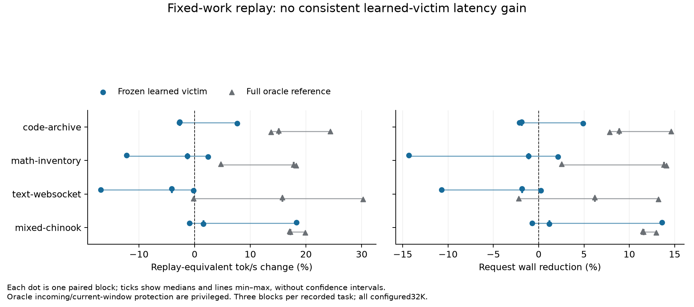

# Golden Swap Phase 1: oracle incoming and causal victim return risk

**MECHANISM_IMPROVED_NO_CONFIRMED_LATENCY_GAIN**

Actual elapsed at report regeneration: **145.06 minutes**. Start 2026-10-06T20:00:37+00:00; hard deadline 2026-10-07T00:00:37+00:00. No deadline reset.

Completed: twelve source-level datasets; two bounded multi-horizon models; development/calibration policy competition; frozen finalist `logistic` with guard threshold `0.5`; 36/36 valid main requests and 12/12 complete three-mode blocks. Integration/safety evidence is in tests and phase-a. Required unmeasured requests: 0. Optional text-tls128K-profile/81.7K-actual transfer check was left unmeasured; no long-context or256K latency claim follows.

The predictor learned return-risk signal and reduced nonlocal main demand by 41–47% on the reserved tasks. That improvement came with 56–104% more weight-copy payload and about 2.45–3.03 seconds of median planner work. Median paired throughput changes were −2.67% archive, −1.29% inventory, −4.11% WebSocket and +1.56% Chinook. None met the predeclared three-block gain criterion. This is evidence that the tested policy changes residency usefully, while its cost proxy, churn and overhead prevent a confirmed latency gain. Exclusive contributions to latency are unknown.

About 44–51% of learned completed copy bytes had no observed use (task medians), compared with 0.06–0.20% for full oracle. Cold re-eviction of newly admitted but not-yet-used experts is a plausible explanation; the counters do not prove it. The model omits policy-dependent admission age. No reserved-result retuning or serving deployment followed.

## Measured replay results

Values are min/median/max unless marked paired median. Replay-equivalent tok/s uses actual emitted tape tokens; WebSocket emits 1773. All four reserved profiles have 32768 configured context. Native decode time ends before final commit wait, copier drain/restoration and tape flushing. Initial tape/state attestation also lies outside native prefill/decode timers. Request wall includes prefill, initial attestation, online scorer/copies, final drain/restoration and flush; completion-inclusive wall is therefore required alongside TG. Startup/warmup/owned shutdown are separate.

| Task/profile | Mode | Valid/attempts | Replay-equivalent tok/s min/median/max | Paired decode-time change | Full-gain retention | Wall s | Local % | CPU/mapped entries | Copy GB | Reload/victim absence | Scorer/planner cost |
|---|---|---|---|---|---|---|---|---|---|---|---|
| code-archive/32k input6983 | REPLAY_CURRENT | 3/3 | 96.74/97.14/97.70 | unknown% | n/a | 31.17/31.31/31.48 | 94.17 | 63663.00/7164.00 | 34.13 | 5125.00/30549.00 | feature0.00/score0.00/selection0.00/planner0.99 ms |
| code-archive/32k input6983 | ORACLE_FULL | 3/3 | 111.07/111.30/120.78 | -13.08% | reference | 26.73/28.69/28.73 | 99.77 | 2591.00/261.00 | 61.97 | 10701.00/1436.00 | feature0.00/score0.00/selection0.00/planner2394.27 ms |
| code-archive/32k input6983 | ORACLE_IN_LEARNED_VICTIM | 3/3 | 94.16/94.44/105.13 | 2.74% | -0.21/-0.15/0.59 | 29.64/31.97/32.07 | 96.55 | 38372.00/3491.00 | 57.03 | 12642.00/15721.00 | feature293.00/score234.18/selection923.07/planner2475.82 ms |
| math-inventory/32k input165 | REPLAY_CURRENT | 3/3 | 97.38/98.09/110.29 | unknown% | n/a | 20.23/22.86/23.00 | 93.70 | 69946.00/8034.00 | 36.37 | 5624.00/33640.00 | feature0.00/score0.00/selection0.00/planner0.99 ms |
| math-inventory/32k input165 | ORACLE_FULL | 3/3 | 115.12/115.47/115.50 | -15.07% | reference | 19.70/19.71/19.76 | 99.65 | 3861.00/467.00 | 62.73 | 10984.00/712.00 | feature0.00/score0.00/selection0.00/planner2377.86 ms |
| math-inventory/32k input165 | ORACLE_IN_LEARNED_VICTIM | 3/3 | 96.83/96.84/99.74 | 1.31% | -3.09/-0.09/0.15 | 22.50/23.12/23.12 | 96.55 | 39650.00/3089.00 | 56.85 | 12295.00/18400.00 | feature314.63/score255.85/selection996.93/planner2630.03 ms |
| text-websocket/32k input30383 | REPLAY_CURRENT | 3/3 | 93.32/96.63/110.86 | unknown% | n/a | 37.13/40.34/41.07 | 93.66 | 60227.00/6574.00 | 32.62 | 5033.00/30092.00 | feature0.00/score0.00/selection0.00/planner0.79 ms |
| text-websocket/32k input30383 | ORACLE_FULL | 3/3 | 110.67/111.84/121.52 | -13.60% | reference | 35.64/37.85/37.96 | 99.69 | 2966.00/269.00 | 57.42 | 9714.00/1315.00 | feature0.00/score0.00/selection0.00/planner2132.11 ms |
| text-websocket/32k input30383 | ORACLE_IN_LEARNED_VICTIM | 3/3 | 92.16/92.66/93.13 | 4.28% | -0.31/-0.16/-0.01 | 40.97/41.09/41.10 | 96.60 | 33243.00/2594.00 | 57.60 | 13192.00/13944.00 | feature283.83/score229.35/selection905.57/planner2453.61 ms |
| mixed-chinook/32k input1899 | REPLAY_CURRENT | 3/3 | 102.80/104.51/105.52 | unknown% | n/a | 24.59/24.75/25.08 | 89.25 | 93526.00/17007.00 | 35.65 | 4295.00/34473.00 | feature0.00/score0.00/selection0.00/planner0.71 ms |
| mixed-chinook/32k input1899 | ORACLE_FULL | 3/3 | 122.49/123.24/123.49 | -14.68% | reference | 21.76/21.83/21.89 | 98.45 | 13705.00/2235.00 | 88.22 | 17598.00/6865.00 | feature0.00/score0.00/selection0.00/planner3225.45 ms |
| mixed-chinook/32k input1899 | ORACLE_IN_LEARNED_VICTIM | 3/3 | 103.53/104.41/124.80 | -1.54% | -0.06/0.09/1.06 | 21.25/24.79/24.93 | 94.27 | 52742.00/6142.00 | 72.61 | 16026.00/24503.00 | feature317.55/score251.19/selection1052.48/planner3027.93 ms |

Scorer feature/model timers are contained inside candidate selection, which is contained inside planner; these overlapping timers must not be summed. Prefix-history updates have no separate timer and remain charged in decode/request wall. Copy GB counts oracle completed weight payload including unused/unpublished copies, native published payload and mandatory oracle restoration. Metadata and up to two sampled D2H byte readbacks per active worker are separate diagnostic traffic, charged in wall, not part of the weight-payload GB column. All attempts, errors and telemetry remain in live-attempts JSON/CSV and raw logs. MTP demand conservation is separate; MTP dispatch subdivisions remain unknown.

## Paired block evidence

| Task/block | Current/full/learned decode s | Full saving s | Learned saving s | Paired learned TG % | Paired learned wall % | Retention | Stable denominator? |
|---|---|---|---|---|---|---|---|
| code-archive/1 | 21.1701/18.4000/21.7504 | 2.7701 | -0.5803 | -2.67 | 1.87 | -0.209 | True |
| code-archive/2 | 21.0835/16.9570/21.6850 | 4.1265 | -0.6015 | -2.77 | 2.11 | -0.146 | True |
| code-archive/3 | 20.9629/18.4394/19.4809 | 2.5235 | 1.4820 | 7.61 | -4.90 | 0.587 | True |
| math-inventory/1 | 18.5700/17.7356/21.1486 | 0.8344 | -2.5786 | -12.19 | 14.32 | -3.090 | True |
| math-inventory/2 | 20.8783/17.7323/21.1512 | 3.1460 | -0.2729 | -1.29 | 1.13 | -0.087 | True |
| math-inventory/3 | 21.0308/17.7907/20.5343 | 3.2401 | 0.4965 | 2.42 | -2.14 | 0.153 | True |
| text-websocket/1 | 18.3490/15.8530/19.1351 | 2.4960 | -0.7861 | -4.11 | 1.85 | -0.315 | True |
| text-websocket/2 | 15.9934/16.0208/19.2390 | -0.0274 | -3.2456 | -16.87 | 10.69 | undefined | False |
| text-websocket/3 | 18.9988/14.5907/19.0388 | 4.4081 | -0.0400 | -0.21 | -0.25 | -0.009 | True |
| mixed-chinook/1 | 19.4080/16.5850/16.4102 | 2.8230 | 2.9978 | 18.27 | -13.59 | 1.062 | True |
| mixed-chinook/2 | 19.5965/16.7201/19.7825 | 2.8764 | -0.1860 | -0.94 | 0.72 | -0.065 | True |
| mixed-chinook/3 | 19.9217/16.6186/19.6158 | 3.3031 | 0.3059 | 1.56 | -1.16 | 0.093 | True |

Retention=(T_current-T_learned)/(T_current-T_full), computed within each block, never clamped. It is undefined for a nonpositive denominator and flagged unstable below 1% of current time. Full oracle is a feasible heuristic, not an optimal bound. Three repeated timings of one tape are not three independent source tasks.

- code-archive: decode faster in 1/3 pairs; wall faster in 1/3; paired TG min/median/max -2.77/-2.67/7.61%; wall -4.90/1.87/2.11%.
- math-inventory: decode faster in 1/3 pairs; wall faster in 1/3; paired TG min/median/max -12.19/-1.29/2.42%; wall -2.14/1.13/14.32%.
- text-websocket: decode faster in 0/3 pairs; wall faster in 1/3; paired TG min/median/max -16.87/-4.11/-0.21%; wall -0.25/1.85/10.69%.
- mixed-chinook: decode faster in 2/3 pairs; wall faster in 2/3; paired TG min/median/max -0.94/1.56/18.27%; wall -13.59/-1.16/0.72%.

## Prediction and frozen selection

Training: development code-heg/math-rational/text-http/mixed-build. Operating point: calibration code-queue/math-sensor/text-tls/mixed-fields. Reserved: code-archive/math-inventory/text-websocket/mixed-chinook. Related source groups remain together and earlier exposure is retained. All twelve are single requests with tool_execution=false.

Uniformly sample up to eight compatible native residents per layer every fourth main window, excluding declared full-current-window protection. Inclusion probability=min(8,N)/N; weight=1/k within a decision. This includes retained candidates rather than only native evictions. Native-policy resident population remains a covariate-selection limitation; simulated/live ownership follows each policy. Prefix-only features do not import policy-dependent native ages or eviction counts.

Thirteen CPU features cover layer/device/byte class, prefix seen flag, last-use distance, fast/slow prefix EMA entries, prefix counts, last/mean gap and gap CV, and observed window count. Unknown pre-request recency is marked with seen=false. Complete native dynamic heat, queue fields and MTP subdivisions are omitted rather than zero-filled. Initial native heat is used only by the matched native-history control/fallback. Feature/scoring parity and suffix tests are in tests.

Return labels use strictly later simultaneous batch demand and inclusive horizons1/4/16/64 main verify windows (48 routed-layer invocations/window). Positive requires an observed return by H; negative requires observation through H; otherwise mask=0. No lane ordering or finite-end negative is invented. These horizons differ from earlier decomposition H64 invocation units.

| Split/model/horizon | Tasks | Mean task AUC | Mean task Brier | Observed rows | Mean weighted positive % | Censored rows |
|---|---|---|---|---|---|---|
| development/logistic/1windows | 4 | 0.7541 | 0.0571 | 253056 | 6.59 | 768 |
| development/logistic/4windows | 4 | 0.7553 | 0.1369 | 252379 | 20.18 | 1445 |
| development/logistic/16windows | 4 | 0.7701 | 0.1934 | 249491 | 46.95 | 4333 |
| development/logistic/64windows | 4 | 0.7858 | 0.1465 | 244380 | 76.18 | 9444 |
| development/tree/1windows | 4 | 0.7586 | 0.0569 | 253056 | 6.59 | 768 |
| development/tree/4windows | 4 | 0.7611 | 0.1357 | 252379 | 20.18 | 1445 |
| development/tree/16windows | 4 | 0.7776 | 0.1907 | 249491 | 46.95 | 4333 |
| development/tree/64windows | 4 | 0.7993 | 0.1433 | 244380 | 76.18 | 9444 |
| calibration/logistic/1windows | 4 | 0.7697 | 0.0495 | 284544 | 5.67 | 384 |
| calibration/logistic/4windows | 4 | 0.7668 | 0.1241 | 283545 | 18.00 | 1383 |
| calibration/logistic/16windows | 4 | 0.7754 | 0.1888 | 280506 | 42.51 | 4422 |
| calibration/logistic/64windows | 4 | 0.8022 | 0.1533 | 273630 | 72.42 | 11298 |
| calibration/tree/1windows | 4 | 0.7702 | 0.0495 | 284544 | 5.67 | 384 |
| calibration/tree/4windows | 4 | 0.7674 | 0.1239 | 283545 | 18.00 | 1383 |
| calibration/tree/16windows | 4 | 0.7722 | 0.1910 | 280506 | 42.51 | 4422 |
| calibration/tree/64windows | 4 | 0.8002 | 0.1559 | 273630 | 72.42 | 11298 |
| reserved_evaluation/logistic/1windows | 4 | 0.7637 | 0.0562 | 261120 | 6.53 | 384 |
| reserved_evaluation/logistic/4windows | 4 | 0.7697 | 0.1329 | 260141 | 20.06 | 1363 |
| reserved_evaluation/logistic/16windows | 4 | 0.7836 | 0.1871 | 257142 | 45.60 | 4362 |
| reserved_evaluation/logistic/64windows | 4 | 0.8271 | 0.1378 | 250356 | 74.81 | 11148 |
| reserved_evaluation/tree/1windows | 4 | 0.7625 | 0.0563 | 261120 | 6.53 | 384 |
| reserved_evaluation/tree/4windows | 4 | 0.7680 | 0.1334 | 260141 | 20.06 | 1363 |
| reserved_evaluation/tree/16windows | 4 | 0.7797 | 0.1894 | 257142 | 45.60 | 4362 |
| reserved_evaluation/tree/64windows | 4 | 0.8226 | 0.1414 | 250356 | 74.81 | 11148 |

Task-level calibration bins and task/family discrimination/support summaries, sampled rankings and learning curves are preserved. No random within-episode split establishes generalization. Within each family/split there is one source group; its calibration bins are the task bins, not evidence from multiple independent groups. Two candidates: logistic C1 and32 depth3 boosting trees/head. No broad search or MLP. Frozen weights remain unchanged in live inference.

Selection record: `{'policy': 'logistic', 'threshold': 0.5, 'calibration_mean_proxy': 0.7675074278387561, 'calibration_task_wins': 4, 'selection_scope': 'All four families, predeclared; development fit and calibration operating point only', 'candidates': [{'policy': 'native', 'threshold': 0.2, 'calibration_mean_proxy': 0.753096877581815, 'calibration_task_wins': 4}, {'policy': 'native', 'threshold': 0.5, 'calibration_mean_proxy': 0.753099370081815, 'calibration_task_wins': 4}, {'policy': 'recency', 'threshold': 0.2, 'calibration_mean_proxy': 0.7554621733766707, 'calibration_task_wins': 4}, {'policy': 'recency', 'threshold': 0.5, 'calibration_mean_proxy': 0.7554241608766706, 'calibration_task_wins': 4}, {'policy': 'logistic', 'threshold': 0.2, 'calibration_mean_proxy': 0.7675188028387561, 'calibration_task_wins': 4}, {'policy': 'logistic', 'threshold': 0.5, 'calibration_mean_proxy': 0.7675074278387561, 'calibration_task_wins': 4}, {'policy': 'tree', 'threshold': 0.2, 'calibration_mean_proxy': 0.7683209386175351, 'calibration_task_wins': 4}, {'policy': 'tree', 'threshold': 0.5, 'calibration_mean_proxy': 0.7683269886175351, 'calibration_task_wins': 4}], 'cheap_reference': {'policy': 'native', 'threshold': 0.2, 'calibration_mean_proxy': 0.753096877581815, 'calibration_task_wins': 4}, 'promising': True, 'version': 'cost-guard-v3', 'copy_cost_assumptions': {'staging_GB_s': 25, 'H2D_GB_s': 13.2, 'assumed_net_entry_gain_us': 160}, 'checkpoint_sha256': '065afa1eec792a5dc2408165d3ecf0206eccce27ccca23da09b4855a5a3a229e', 'ranking_weights': [1, 0.5, 0.25, 0.125], 'fallback': 'Invalid scores use same causal native-heat proxy; no victim-future fallback', 'frozen_utc': '2026-10-06T20:38:15.217799+00:00'}`

The matched cheap native/history rule achieved a lower calibration proxy than the selected learned model. The learned finalist was selected among learned candidates to answer the predictor question; its offline promise is relative to replay-current, not proof of superiority to the cheap rules. No cheap-control live latency result is available in the main three-mode matrix.

Victim rank minimizes p1+0.5p4+0.25p16+0.125p64. Common causal exchange guard requires the existing incoming16-window count to cover assumed staging/copy cost at160us net gain per routed entry plus p16-weighted prefix-rate victim loss. The160us figure is an assumed operating point, not an exclusive measuredCPU cost. A risk-only v1 caused excessive traffic; a40us v2 under-admitted and exposed repeated-scan overhead. Both negative versions remain under versions/. Same-event compatible selection now caches with ownership and prefix-history invalidation. The frozen guard also vetoes risk above the frozen threshold at the incoming demand interval; interval risk uses p1 conservatively through one window and linear interpolation toward p4 beyond it. This proxy treats near returns as costly and retains long-risk protection; it is not exact counterfactual regret or a measured latency model. Matched native/recency controls receive identical guard thresholds and physical scheduler. Incoming candidate order/E64/first-feasible protocol are fixed. No extra incoming ranker is added.

Scores are CPU-only and cached per expert for at most one main window; a completed batch invalidates its layer. Current slot identity and full-window protection are rechecked at publication. NO_SWAP retains normal CPU/mapped expert computation. Invalid scores use causal native-history fallback; no victim-future fallback. No new allocator, lease, queue, GPU model buffers, extra experts or online weight fitting.

## Offline policy evidence

The original recorded replay-current denominator and native slots are reconstructed exactly from issue/publication timestamps and validated against every routed entry. Transfer policies share initial state, slot classes, five charged spares and policy-specific ownership. The modeled main cadence0.57ms/invocation, MTP2.5ms/window, staging25GB/s, H2D13.2GB/s and publication45us are inherited assumptions. There is no exclusive CPU-latency model; modeled nonlocal demand/copy traffic is not measured TG or measured oracle-gain retention. No offline speed claim is made.

| Task/split | Policy/threshold | Nonlocal entries | Copy GB | Victim absence | Rejections | CPU evaluator wall s | Selection ms |
|---|---|---|---|---|---|---|---|
| code-heg/development | current/None | 109351 | 40.291 | None | unknown | n/a | n/a |
| code-heg/development | full/None | 2614 | 100.866 | 917 | 0 | 1.218468868988566 | 0 |
| code-heg/development | native/0.2 | 58575 | 101.900 | 26068 | 2433904 | 1.3683671649778262 | 539.535 |
| code-heg/development | native/0.5 | 58575 | 101.900 | 26068 | 2433904 | 1.3685065349563956 | 531.183 |
| code-heg/development | recency/0.2 | 58629 | 101.478 | 26134 | 2420477 | 1.4189333589747548 | 593.011 |
| code-heg/development | recency/0.5 | 58629 | 101.478 | 26134 | 2420477 | 1.46839784597978 | 587.509 |
| code-heg/development | logistic/0.2 | 59055 | 107.473 | 25921 | 2363063 | 1.4682089470443316 | 664.51 |
| code-heg/development | logistic/0.5 | 59055 | 107.473 | 25921 | 2363063 | 1.5181397030246444 | 668.753 |
| code-heg/development | tree/0.2 | 58935 | 102.735 | 25943 | 2410553 | 3.2720022440189496 | 2387.62 |
| code-heg/development | tree/0.5 | 58935 | 102.735 | 25943 | 2410553 | 3.2715029869577847 | 2384.96 |
| math-rational/development | current/None | 94380 | 36.195 | None | unknown | n/a | n/a |
| math-rational/development | full/None | 1559 | 68.493 | 18 | 0 | 1.0689930820371956 | 0 |
| math-rational/development | native/0.2 | 43386 | 79.596 | 19801 | 1985738 | 1.2681222470127977 | 449.095 |
| math-rational/development | native/0.5 | 43386 | 79.596 | 19801 | 1985738 | 1.217951460974291 | 443.668 |
| math-rational/development | recency/0.2 | 43345 | 80.067 | 19942 | 2000263 | 1.31872362899594 | 504.722 |
| math-rational/development | recency/0.5 | 43345 | 80.067 | 19942 | 2000263 | 1.3178625609725714 | 496.307 |
| math-rational/development | logistic/0.2 | 44470 | 83.099 | 20038 | 1985539 | 1.3681840160279535 | 564.322 |
| math-rational/development | logistic/0.5 | 44470 | 83.099 | 20038 | 1985539 | 1.368353825993836 | 561.718 |
| math-rational/development | tree/0.2 | 43769 | 78.184 | 19697 | 1994365 | 2.771334939985536 | 1950.29 |
| math-rational/development | tree/0.5 | 43769 | 78.184 | 19697 | 1994365 | 2.77102391194785 | 1950.05 |
| text-http/development | current/None | 80914 | 35.488 | None | unknown | n/a | n/a |
| text-http/development | full/None | 310 | 78.179 | 247 | 0 | 1.1181575689697638 | 0 |
| text-http/development | native/0.2 | 44226 | 85.032 | 19275 | 1961571 | 1.3190391579992138 | 455.658 |
| text-http/development | native/0.5 | 44226 | 85.032 | 19275 | 1961571 | 1.2679663460003212 | 448.225 |
| text-http/development | recency/0.2 | 44201 | 84.939 | 19246 | 1951339 | 1.3180448319762945 | 496.046 |
| text-http/development | recency/0.5 | 44201 | 84.939 | 19246 | 1951339 | 1.368290116020944 | 497.887 |
| text-http/development | logistic/0.2 | 43995 | 82.481 | 18519 | 1936874 | 1.4182570410193875 | 546.013 |
| text-http/development | logistic/0.5 | 43995 | 82.481 | 18519 | 1936874 | 1.4182764920406044 | 545.161 |
| text-http/development | tree/0.2 | 44133 | 77.339 | 18550 | 1984077 | 2.770769882015884 | 1884.52 |
| text-http/development | tree/0.5 | 44133 | 77.339 | 18550 | 1984077 | 2.7703826539800502 | 1886.09 |
| mixed-build/development | current/None | 82311 | 31.310 | None | unknown | n/a | n/a |
| mixed-build/development | full/None | 594 | 76.352 | 506 | 0 | 1.0174055199604481 | 0 |
| mixed-build/development | native/0.2 | 46592 | 68.299 | 18600 | 2232940 | 1.1176868599723093 | 381.759 |
| mixed-build/development | native/0.5 | 46592 | 68.299 | 18600 | 2232940 | 1.1179474799428135 | 381.386 |
| mixed-build/development | recency/0.2 | 46925 | 68.022 | 18929 | 2250318 | 1.1678344450192526 | 427.746 |
| mixed-build/development | recency/0.5 | 46925 | 68.022 | 18929 | 2250318 | 1.1678164649638347 | 427.33 |
| mixed-build/development | logistic/0.2 | 47746 | 73.064 | 19161 | 2215734 | 1.2678029470262118 | 498.803 |
| mixed-build/development | logistic/0.5 | 47746 | 73.064 | 19161 | 2215734 | 1.2684580949717201 | 500.106 |
| mixed-build/development | tree/0.2 | 47433 | 67.596 | 18759 | 2251342 | 2.5201327379909344 | 1785.46 |
| mixed-build/development | tree/0.5 | 47433 | 67.596 | 18759 | 2251342 | 2.5200460180058144 | 1777.58 |
| code-queue/calibration | current/None | 82420 | 36.327 | None | unknown | n/a | n/a |
| code-queue/calibration | full/None | 91 | 77.477 | 82 | 0 | 1.0676423650002107 | 0 |
| code-queue/calibration | native/0.2 | 45555 | 84.696 | 19005 | 2097850 | 1.2680819969973527 | 453.541 |
| code-queue/calibration | native/0.5 | 45555 | 84.696 | 19005 | 2097850 | 1.2677628370001912 | 464.041 |
| code-queue/calibration | recency/0.2 | 45682 | 85.125 | 19125 | 2100982 | 1.3179171420051716 | 505.316 |
| code-queue/calibration | recency/0.5 | 45682 | 85.125 | 19125 | 2100982 | 1.318747226963751 | 510.099 |
| code-queue/calibration | logistic/0.2 | 46212 | 85.279 | 19006 | 2084381 | 1.3679769480368122 | 579.874 |
| code-queue/calibration | logistic/0.5 | 46212 | 85.279 | 19006 | 2084381 | 1.3684440450160764 | 571.744 |
| code-queue/calibration | tree/0.2 | 46252 | 81.927 | 18966 | 2100920 | 2.9210822579916567 | 2072.59 |
| code-queue/calibration | tree/0.5 | 46252 | 81.927 | 18966 | 2100920 | 2.921673776989337 | 2083.64 |
| math-sensor/calibration | current/None | 77497 | 33.507 | None | unknown | n/a | n/a |
| math-sensor/calibration | full/None | 166 | 63.575 | 0 | 0 | 1.0672759870067239 | 0 |
| math-sensor/calibration | native/0.2 | 40119 | 71.244 | 15498 | 2013119 | 1.2177517809905112 | 395.588 |
| math-sensor/calibration | native/0.5 | 40119 | 71.244 | 15498 | 2013119 | 1.3186851580394432 | 395.25 |
| math-sensor/calibration | recency/0.2 | 39893 | 70.988 | 15641 | 2031873 | 1.2680503660230897 | 441.877 |
| math-sensor/calibration | recency/0.5 | 39893 | 70.988 | 15641 | 2031873 | 1.2679440960055217 | 434.344 |
| math-sensor/calibration | logistic/0.2 | 41060 | 72.672 | 15652 | 2023822 | 1.3181198120000772 | 498.4 |
| math-sensor/calibration | logistic/0.5 | 41060 | 72.672 | 15652 | 2023822 | 1.2678584970417432 | 501.626 |
| math-sensor/calibration | tree/0.2 | 40474 | 68.493 | 15754 | 2056783 | 2.620522136974614 | 1731.75 |
| math-sensor/calibration | tree/0.5 | 40474 | 68.493 | 15754 | 2056783 | 2.570282402972225 | 1711.2 |
| text-tls/calibration | current/None | 71738 | 33.639 | None | unknown | n/a | n/a |
| text-tls/calibration | full/None | 201 | 64.086 | 149 | 0 | 1.318593439005781 | 0 |
| text-tls/calibration | native/0.2 | 41619 | 58.708 | 14802 | 2125832 | 1.4691348650376312 | 356.635 |
| text-tls/calibration | native/0.5 | 41619 | 58.708 | 14802 | 2125832 | 1.418447470990941 | 353.539 |
| text-tls/calibration | recency/0.2 | 41844 | 59.851 | 15002 | 2126344 | 1.518764371983707 | 416.778 |
| text-tls/calibration | recency/0.5 | 41844 | 59.851 | 15002 | 2126344 | 1.4683837069896981 | 400.994 |
| text-tls/calibration | logistic/0.2 | 41769 | 61.888 | 14633 | 2105722 | 1.6189404019969516 | 434.423 |
| text-tls/calibration | logistic/0.5 | 41769 | 61.888 | 14633 | 2105722 | 1.51900403999025 | 434.45 |
| text-tls/calibration | tree/0.2 | 42096 | 58.291 | 14802 | 2138046 | 2.7710706209763885 | 1629.88 |
| text-tls/calibration | tree/0.5 | 42096 | 58.291 | 14802 | 2138046 | 2.770759364007972 | 1655.96 |
| mixed-fields/calibration | current/None | 75897 | 32.108 | None | unknown | n/a | n/a |
| mixed-fields/calibration | full/None | 378 | 58.427 | 99 | 0 | 0.9673367060022429 | 0 |
| mixed-fields/calibration | native/0.2 | 38062 | 71.898 | 15639 | 1817071 | 1.1676807460025884 | 405.709 |
| mixed-fields/calibration | native/0.5 | 38062 | 71.898 | 15639 | 1817071 | 1.1675690659903921 | 399.64 |
| mixed-fields/calibration | recency/0.2 | 37992 | 72.802 | 15644 | 1813640 | 1.2177351709688082 | 446.967 |
| mixed-fields/calibration | recency/0.5 | 37992 | 72.802 | 15644 | 1813640 | 1.2680109859793447 | 450.296 |
| mixed-fields/calibration | logistic/0.2 | 38267 | 76.194 | 15253 | 1779834 | 1.3679050770006143 | 507.087 |
| mixed-fields/calibration | logistic/0.5 | 38267 | 76.194 | 15253 | 1779834 | 1.2677836559596471 | 507.414 |
| mixed-fields/calibration | tree/0.2 | 38208 | 71.932 | 15309 | 1823996 | 2.620210367953405 | 1802.87 |
| mixed-fields/calibration | tree/0.5 | 38208 | 71.932 | 15309 | 1823996 | 2.569919603993185 | 1788.71 |
| code-archive/reserved_evaluation | current/None | 70827 | 34.128 | None | unknown | n/a | n/a |
| code-archive/reserved_evaluation | full/None | 172 | 64.404 | 89 | 0 | 1.3199092539725825 | 0 |
| code-archive/reserved_evaluation | native/0.5 | 39588 | 72.101 | 15482 | 1869925 | 1.3681131360353902 | 405.571 |
| code-archive/reserved_evaluation | recency/0.5 | 39846 | 73.201 | 15758 | 1872708 | 1.3686607160489075 | 441.235 |
| code-archive/reserved_evaluation | logistic/0.5 | 40241 | 71.632 | 15614 | 1879211 | 1.368110966985114 | 486 |
| math-inventory/reserved_evaluation | current/None | 77980 | 36.374 | None | unknown | n/a | n/a |
| math-inventory/reserved_evaluation | full/None | 254 | 64.611 | 0 | 0 | 1.3182089899783023 | 0 |
| math-inventory/reserved_evaluation | native/0.5 | 40439 | 72.680 | 18207 | 1978048 | 1.3193945260136388 | 412.773 |
| math-inventory/reserved_evaluation | recency/0.5 | 40498 | 72.552 | 18348 | 1984775 | 1.3682338270009495 | 458.796 |
| math-inventory/reserved_evaluation | logistic/0.5 | 41146 | 73.756 | 18293 | 1974306 | 1.4184509509941563 | 526.279 |
| text-websocket/reserved_evaluation | current/None | 66801 | 32.619 | None | unknown | n/a | n/a |
| text-websocket/reserved_evaluation | full/None | 48 | 60.090 | 15 | 0 | 1.118357838015072 | 0 |
| text-websocket/reserved_evaluation | native/0.5 | 34022 | 72.986 | 13462 | 1591736 | 1.1676819160347804 | 389.219 |
| text-websocket/reserved_evaluation | recency/0.5 | 34095 | 72.506 | 13585 | 1595838 | 1.2177504010032862 | 434.856 |
| text-websocket/reserved_evaluation | logistic/0.5 | 34445 | 75.510 | 13476 | 1580319 | 1.217767821974121 | 485.918 |
| mixed-chinook/reserved_evaluation | current/None | 110533 | 35.650 | None | unknown | n/a | n/a |
| mixed-chinook/reserved_evaluation | full/None | 1483 | 100.956 | 579 | 0 | 1.1679629950085655 | 0 |
| mixed-chinook/reserved_evaluation | native/0.5 | 55364 | 87.327 | 24873 | 2407372 | 1.1176193599822 | 436.056 |
| mixed-chinook/reserved_evaluation | recency/0.5 | 54911 | 86.372 | 24647 | 2420307 | 1.2173493430018425 | 477.455 |
| mixed-chinook/reserved_evaluation | logistic/0.5 | 55916 | 90.214 | 24478 | 2357097 | 1.2178208209807053 | 551.392 |

## Fidelity, safety and physical costs

Runtime identity: `{'source': '/srv/ai/research/iq3s-residency-20261004T230051Z/campaigns/golden-swap-phase1-20261006T200037Z/source/runtime', 'build': '/srv/ai/research/iq3s-residency-20261004T230051Z/campaigns/golden-swap-phase1-20261006T200037Z/builds/runtime', 'exe': '/srv/ai/research/iq3s-residency-20261004T230051Z/campaigns/golden-swap-phase1-20261006T200037Z/builds/runtime/strata', 'source_sha': '20e1e10f6848f11ec5580fc5ec7f97ea5d4e520b', 'binary_sha256': 'ccea78b7e67cd0d634880160f8d9d571ef65263d41622232ef149c6bb76038e3', 'capture_substrate': '117bc89b3bacbf263379c336557e6c8aa07aff5e', 'decomposition_substrate': 'bbfea2955ec238f7e6406b11c74e577c996c4a8d', 'original_source': '6f32ec070f23ced9f50e704d854d775da52591ab', 'settings': 'Q4/K24/PCIe.28/100us/15workers/MTP4minp.5/INT8KV/kvresident32768/prefillauto/suffixreuseOFF', 'base_configs_sha256': '2dd93120d9d1c8202304e88c4c6586a8f94692210c1def5bad71fda7a9ffc5f6', 'frozen_selection_sha256': 'c7ebf4eafa0bd319f0b85e059b17b87aaf76c6531d1f95568fb97d29f1cc9093'}`.

Unchanged original binary SHA256 eca9d0d271340a114955d5af8038dbffa139ad096ef0d470bcfea9009d4f8d0d/source6f32ec070f23ced9f50e704d854d775da52591ab; model revision38bb39ee97821de2c9009abb7e93950eec396e66. Phase0 capture117bc89 and decompositionbbfea295 compatibility is checked, not assumed. Two RTX4090, K24, PCIe0.28, pool100us/15workers, MTP4/minp0.5, INT8KV/kv-resident32768, prefillauto and reuse/suffixOFF.

Same48main routed layers/allthree byteclasses and five charged spares are used; replay-current retains normal capacity/adaptation. Immutable full-RAM backing and copy completion/publication ownership remain intact. Each arm uses a fresh server, saved64-token warmup, natural prefill and exact recorded initial state. Future tape/index RAM initialization is common setup and disclosed; no future expert weights are loaded during untimed setup. All online model/planning work and real copies remain charged. The experimental scorer remains disabled in normal launchers.

Short-input QSA validates active min(n_kv,2051) width, preserving unused capacity. Final EOS can occur inside the last accepted window; emitted count and committed state count are separately checked. Live fidelity validates exact input/output IDs, window/MTP counts, native work FNV/SHA, QSA branch coverage, meaningful initial state sidecars and finite activation samples. Enforced output identity does not prove natural generation or quality. The inherited expert paths use CPU Q8_K versus GPU Q8_1 activation quantization and different summation order. Placement can change intermediate activations and pre-override native heads; these are sampled numerical diagnostics, not full tensor parity or natural-generation quality. Per-arm fidelity JSON preserves relative L2, maximum difference and first differing sampled component; forced work fingerprints and copied-byte/ownership checks are separate.

Safety test logs retain invalid score fallback, NO_SWAP, protected victims, changed ownership, future suffix invariance, duplicate in-flight copies, real copied-byte checks across all classes/devices, late completion, spare reuse, cancellation/drain/restoration and next-request/shutdown behavior. Existing targeted native tests are reported with their actual results; historical full-suite environment failures are not represented as new passes.

Per-arm raw telemetry includes CPU/steal and both GPU memory/utilization/power/clocks. No host settings changed; no favorable-run filtering, fourth unchanged attempt or steal correction. Counterbalancing reduces but does not eliminate VM drift. Local share, victim absence and overlapping CPU/GPU/planner times are not exclusive causal latency. Unknown rejection subreasons/MTP path subdivisions remain unknown.

## Protocol deviations, limitations and next experiment

Dataset/state reconstruction smoke passed before the larger fit. The first compiled scorer/policy end-to-end smoke followed the larger bounded fit rather than preceding it; this order deviation is retained. No raw tape was recaptured. All held-out results and invalid attempts remain in the ledger. Source correctness repairs, if any, are versioned and old results preserved.

One physical VM, three groups/family, previously exposed source groups, finite2048-token slices (WebSocket1773), no guard tail and no tool execution limit generality. The scope is oracle incoming plus causal victim ranking with oracle current-window safety; it is not a fully causal production scheduler or natural serving speedup. Full oracle may exploit finite tape ending and is not an optimal upper bound.

Strongest next experiment: compare this frozen logistic policy with the matched cheap history rule on predeclared independent source groups with an observed guard tail, keeping oracle incoming, protection and physical capacity identical. Audit newly admitted but not-yet-used experts and completion-inclusive wall; causal admission-age features are a bounded follow-up if cold re-eviction is confirmed. The cheaper rule scored better offline and has no live latency comparison here, so incremental benefit from learning remains unknown.

## Exact reproduction

See reproduce.md for tested commands and identity checks. Dataset/model scripts operate on existing tapes and fixed source-level roles. Replay commands never update or rebuild the runtime, verify model/binary/checkpoint/config identities, use finite timeouts and stop only owned processes. Normal serving launchers remain unchanged.

Primary research conclusion: **MECHANISM_IMPROVED_NO_CONFIRMED_LATENCY_GAIN**.

## Timing, memory and numerical diagnostics

Each cell below is the median of three preserved main attempts; final-diagnostics.json retains min/median/max. Startup excludes saved warmup; request wall includes initial attestation and completion work. Publication and drain/restoration timers overlap other work and are not added to decode. Host RSS includes the model and immutable backing, not solely the scorer.

| Task/mode | Prefill s | Startup/warmup/owned cleanup s | Publication/drain/restore ms | Peak host RSS GiB | Unused completed payload % | Victim returns/censored | Sample relative L2 | Native head agreement % |
|---|---|---|---|---|---|---|---|---|
| code-archive/REPLAY_CURRENT | 9.36 | 64.07/7.78/5.18 | 0.00/0.00/0.00 | 76.56 | n/a | 7952.00/2870.00 | 0.00000 | 100.000 |
| code-archive/ORACLE_FULL | 9.39 | 62.08/7.82/4.78 | 1066.64/0.00/1.45 | 76.58 | 0.06 | 10901.00/8616.00 | 0.02340 | 99.644 |
| code-archive/ORACLE_IN_LEARNED_VICTIM | 9.35 | 65.08/7.72/4.95 | 1118.10/0.00/1.47 | 76.58 | 50.11 | 15487.00/2397.00 | 0.02402 | 99.605 |
| math-inventory/REPLAY_CURRENT | 1.13 | 78.09/7.73/5.46 | 0.00/0.00/0.00 | 76.53 | n/a | 8245.00/3291.00 | 0.00000 | 100.000 |
| math-inventory/ORACLE_FULL | 1.13 | 82.10/7.75/5.01 | 1040.06/0.00/1.43 | 76.55 | 0.06 | 11034.00/8787.00 | 0.02767 | 99.419 |
| math-inventory/ORACLE_IN_LEARNED_VICTIM | 1.13 | 75.07/7.77/5.50 | 1154.65/0.00/1.53 | 76.55 | 44.43 | 15001.00/2858.00 | 0.02668 | 99.302 |
| text-websocket/REPLAY_CURRENT | 20.96 | 69.07/7.70/4.98 | 0.00/0.00/0.00 | 76.50 | n/a | 7524.00/2857.00 | 0.00000 | 100.000 |
| text-websocket/ORACLE_FULL | 20.93 | 59.08/7.78/5.17 | 954.92/0.00/1.46 | 76.53 | 0.14 | 9846.00/8341.00 | 0.02381 | 99.453 |
| text-websocket/ORACLE_IN_LEARNED_VICTIM | 20.91 | 58.09/7.78/5.35 | 1147.97/0.00/1.52 | 76.53 | 50.03 | 15742.00/2471.00 | 0.02309 | 99.590 |
| mixed-chinook/REPLAY_CURRENT | 4.32 | 76.07/7.72/4.87 | 0.00/0.00/0.00 | 76.45 | n/a | 8362.00/3059.00 | 0.00000 | 100.000 |
| mixed-chinook/ORACLE_FULL | 4.32 | 73.09/7.76/4.79 | 1454.26/0.00/1.44 | 76.47 | 0.20 | 18574.00/9579.00 | 0.04764 | 100.000 |
| mixed-chinook/ORACLE_IN_LEARNED_VICTIM | 4.29 | 71.09/7.71/4.68 | 1492.86/0.00/1.53 | 76.47 | 51.05 | 20371.00/2786.00 | 0.04651 | 100.000 |

The fixed scorer/history/cache object is 2,163,920 bytes (2.06 MiB), charged on the host in all three modes; it allocates no GPU model buffers. Five spare slots consume 17,305,600 weight bytes inside the existing oracle envelope; current keeps its full ordinary capacity. GPU memory, clocks, power/utilization and CPU/steal ranges remain in live-attempts.json and raw telemetry. Pending oracle and native copy work at request end was zero in all 36 main requests.

Replay-current sampled activations were bitwise equal to the recorded native samples in all 12 attempts. Full/learned samples differ as shown above; pre-override head agreement is diagnostic and forced token/work equality does not establish natural-generation quality. Work/route/coefficient/initial-state checks remain separate from numerical samples.

## Validation and completion evidence

Scorer parity: 4,000 predictions per retained model; maximum absolute error 1.32e-7 for logistic and zero for trees. Causal-history parity checked 300 completed batches with maximum feature error 1.18e-7. The original full-reference decision fixture checked 610 decisions. Policy fixtures passed protection, ownership change, invalid-score fallback, NO_SWAP and unseen-future invariance. All 12 main learned requests had zero victim-future queries and zero invalid scores.

Nine relevant existing native tests passed (tests/targeted-native.log): QSA top-k active parity, grouped parity, route-window parity, KV-stream parity, draft and coupled-draft policies, and three Q4_K/Q5_K expert/activation parity combinations. No new full suite was run. Real CUDA fixtures passed copied-byte checks, charged slots, repeated spare reuse, cancellation/drain/restore and next-request behavior.

The first learned real-copy fixture aborted after it changed the protected route set without advancing the logical event, violating the event-keyed cache contract. The fixture was repaired to advance the event; the runtime, checkpoint and guard were unchanged. Original fixture/source and failed log remain at tests/oracle_fixture-before-event-repair.cpp and tests/real-copy-learned.log; successful rechecks are tests/real-copy-learned-attempt2.log, tests/real-copy-full-attempt2.log and tests/cost-guard-fixture-attempt2.log. Bookkeeping/compile failures and partial development guard versions are preserved in the ledger and versions directory.

The two tested risk thresholds (.2 and .5) produced identical offline action accounting in all 32 development/calibration task-policy comparisons. Their small selection-proxy differences came from measured CPU evaluator timing rather than a demonstrated threshold advantage. The frozen .5 operating point remains unchanged (results/operating-point-diagnostics.json).

All three isolated development reproducer commands actually ran and passed, plus a prepare-only check (tests/reproduction-checks.json). They are separate from the 36 main requests; including matching preflights, each math-rational point has two attempts. External reproduction outputs are linked and hashed in references/reproduction-artifacts.json.

The final requirement audit and cleanup proof are completion-audit.json and cleanup-proof.json. artifact-manifest.json hashes retained artifacts and records explicit exclusions; source, executable and checkpoint identities are recorded separately. STATUS.md records final elapsed time and completion. The compiled end-to-end smoke ordering deviation remains documented rather than being claimed as compliant.

Primary research conclusion: **MECHANISM_IMPROVED_NO_CONFIRMED_LATENCY_GAIN**.
